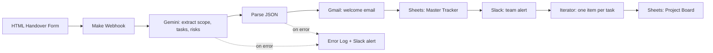
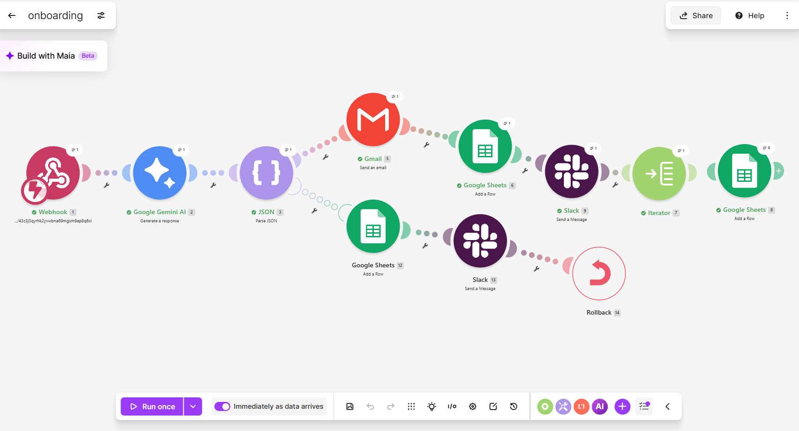
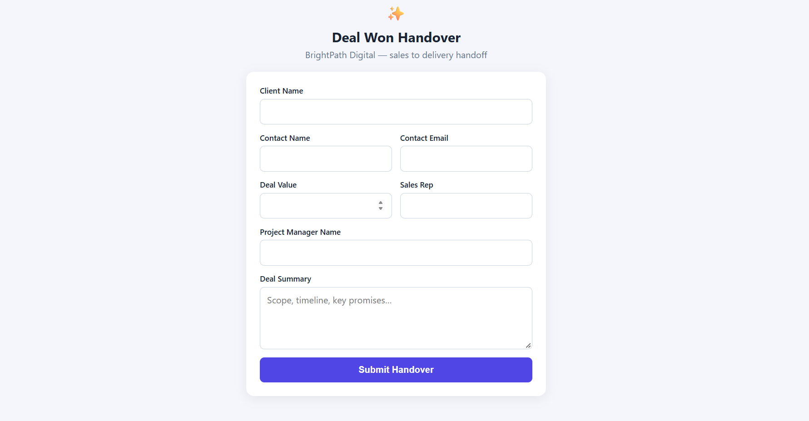
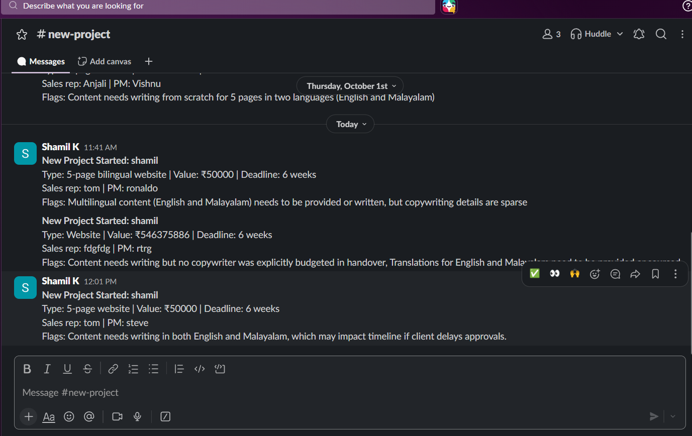
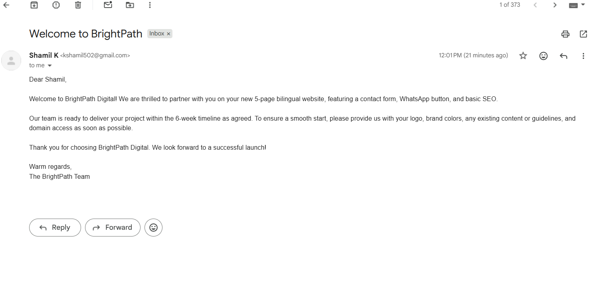
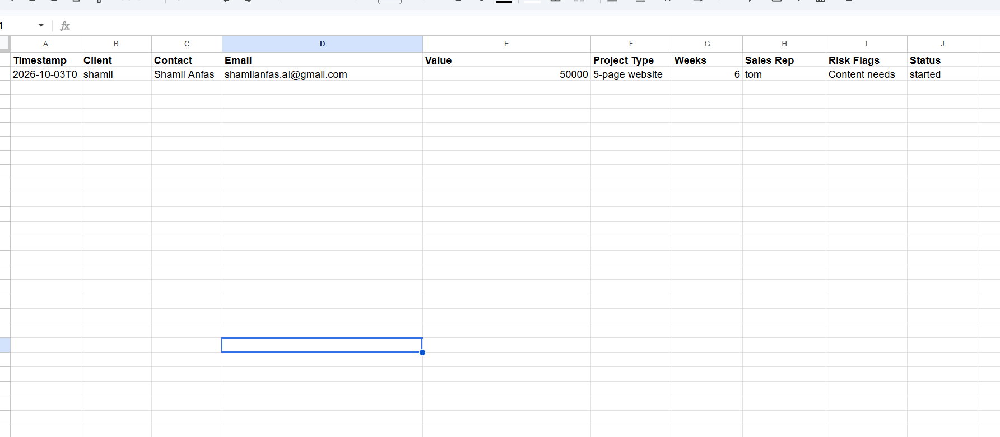
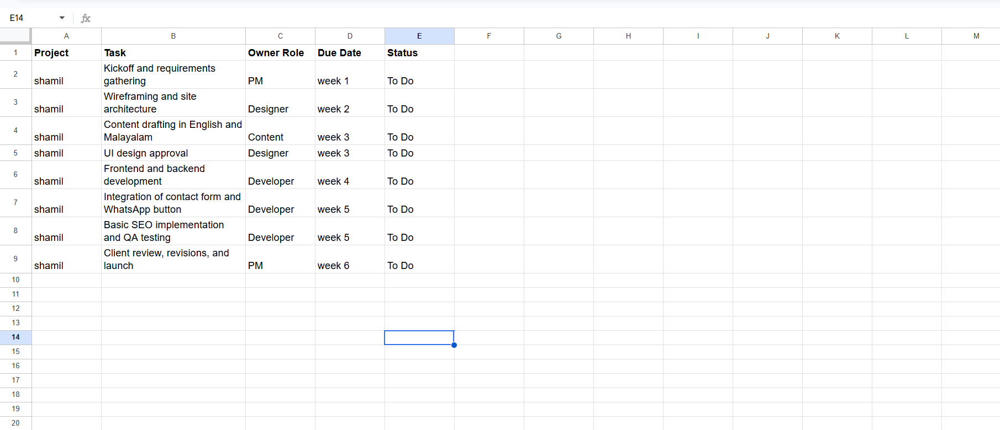

# AI Client Onboarding Automation

An automation built in **Make** that turns a sales handover into a fully set-up client project in seconds. An AI model reads the deal notes, extracts the scope, plans the tasks and flags risks. The workflow then writes the project board, sends the client a welcome email and alerts the delivery team on Slack.

> This is a portfolio project built around a **simulated business scenario**. All names, deals and data in this repository are fictional.

---

## The Problem

In a small services business, the handover from sales to delivery is usually manual and inconsistent:

- The sales rep describes the deal in a long message or a call, and details get lost.
- A project manager has to re-read the notes, create a task list, write a welcome email and tell the team, often copy-pasting between several tools.
- Steps get skipped, welcome emails go out late, and scope risks (such as work that was never quoted) are noticed too late.

## The Solution

When a deal is closed, the sales rep submits one **handover form**. From that point the automation:

1. Receives the form data through a webhook.
2. Sends the deal notes to an LLM (Google Gemini), which returns **structured JSON**: project type, deliverables, deadline, a task plan, risk flags and a draft welcome email.
3. Parses the AI output into separate fields.
4. Emails the client a personalized welcome message.
5. Logs the project in a **Master Tracker** sheet.
6. Posts a summary to the delivery team's **Slack** channel, including any risk flags.
7. Loops through the AI-generated task list and writes **one row per task** to a **Project Board** sheet.
8. If anything fails, logs the error to an **Error Log** sheet and alerts the team on Slack.

## Architecture



**Design notes**

- **Webhook trigger** gives an instant start instead of waiting for a polling schedule.
- **The AI returns JSON** so every later step can use individual fields (task titles, owners, weeks, risks) instead of one block of text.
- **The Iterator comes last** on purpose. Everything after it runs once per task, so the one-time steps (email, tracker row, Slack message) are placed before it. Otherwise the client would receive one email per task.
- **Risk flags** let the AI point out unclear or unquoted scope so a human can follow up before work starts.

## Tech Stack

| Layer                      | Tool                                     |
| -------------------------- | ---------------------------------------- |
| Automation platform        | Make                                     |
| AI model                   | Google Gemini (Flash-Lite)               |
| Trigger                    | Custom webhook, fed by a plain HTML form |
| Data store / project board | Google Sheets                            |
| Client email               | Gmail                                    |
| Team notifications         | Slack                                    |

## Example

**Handover form input**

```json
{
  "client_name": "Example Traders",
  "contact_name": "Jane Doe",
  "contact_email": "client@example.com",
  "deal_value": 60000,
  "sales_rep": "Sales Rep",
  "pm_name": "Project Manager",
  "deal_summary": "5-page website with contact form, WhatsApp button and basic SEO. Client has a logo and brand colors, content needs writing. English and a second language. Launch in 6 weeks."
}
```

**Structured output from the AI (abridged)**

```json
{
  "project_type": "Website build",
  "deliverables": [
    "5-page website",
    "Contact form",
    "WhatsApp button",
    "Basic SEO"
  ],
  "deadline_weeks": 6,
  "risk_flags": ["Content writing is not clearly included in the quote"],
  "tasks": [
    {
      "title": "Kickoff call and content collection",
      "week": 1,
      "owner_role": "PM"
    },
    { "title": "Design mockups", "week": 2, "owner_role": "Designer" }
  ],
  "welcome_email": "..."
}
```

## Google Sheet Structure

The workbook has three tabs. Row 1 must contain these headers exactly:

| Tab                | Columns                                                                                      |
| ------------------ | -------------------------------------------------------------------------------------------- |
| **Master Tracker** | Timestamp, Client, Contact, Email, Value, Project Type, Weeks, Sales Rep, Risk Flags, Status |
| **Project Board**  | Project, Task, Owner Role, Due Date, Status                                                  |
| **Error Log**      | Timestamp, Client, Error Message                                                             |

## Error Handling

AI providers and third-party APIs fail sometimes. During development the Gemini API returned a `503 high demand` error, which is exactly the kind of failure this is built for.

An error-handling route is attached to the AI and parsing steps. When one of them fails, the workflow:

1. Writes the timestamp, client and error message to the **Error Log** sheet.
2. Sends an alert to a dedicated Slack errors channel.
3. Ends the run as failed, so a failed onboarding never looks successful in the run history.

## Setup

### Prerequisites

- A Make account (the free plan is enough)
- A Google account (Sheets and Gmail)
- A Slack workspace with two public channels: one for new projects and one for errors
- A free Gemini API key from Google AI Studio

### Steps

1. **Create the Google Sheet** with the three tabs and headers shown above.
2. **Import the blueprint:** in Make, create a new scenario, open the menu (three dots), choose **Import Blueprint** and select `blueprint/client-onboarding-blueprint.json`.
3. **Reconnect your accounts** in each module (Gemini, Gmail, Google Sheets, Slack). Connections are never included in a blueprint.
4. **Point the Sheets modules** to your spreadsheet and select the correct tab in each.
5. **Select your Slack channels** in the team alert and error alert modules.
6. **Copy the webhook URL** from the Webhook module.
7. **Configure the form:** copy `form/config.example.js` to `form/config.js`, paste your webhook URL into it, and open `form/index.html` in a browser.
8. **Turn the scenario on** and submit a test handover.

> Use your own email address as the contact email while testing, so no real person receives a message.

## Testing

| Test case                              | Expected result                                                |
| -------------------------------------- | -------------------------------------------------------------- |
| Normal, detailed deal                  | Email sent, 1 tracker row, 1 Slack message, 6 to 9 board rows  |
| Vague deal ("website, ASAP")           | Risk flags point out the missing scope and deadline            |
| Large multi-service deal               | Task count stays within range, weeks never exceed the deadline |
| Deliberate failure (invalid AI output) | Error Log row, Slack error alert, run marked as failed         |

## Screenshots

|                                                  |                                                 |
| ------------------------------------------------ | ----------------------------------------------- |
|             |                    |
|     |  |
|  |    |

## Repository Structure

```
.
├── README.md
├── handover.html
├── blueprint/
│   └── client-onboarding-blueprint.json
└── screenshots/
```
